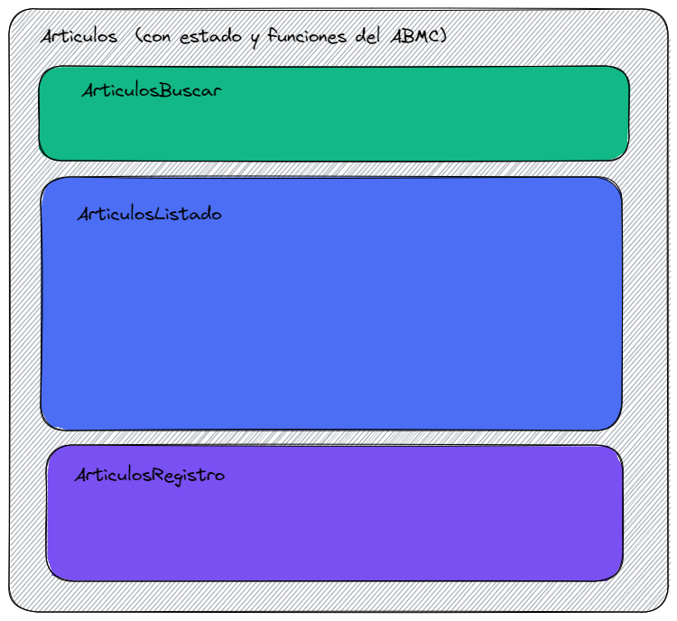

# Desarrollo de Sotware: Frontend
Objetivo: crear una Aplicación frontend con vistas en Html, Boostrap y código javascript con React, que consumira las webapi de nuestro backend: dds-backend. Nuestra aplicacion estara compuesta por un menu que nos permitirá navegar entre una página de inicio, una página de consulta sobre la tabla ArticulosFamlias y una página que nos permitirá realizar un ABMC sobre la tabla Articulos.

* Version final del proyecto: https://dds-frontend.azurewebsites.net

* Requisitos tener instalado:
    * Visual studio Code
    * Node.js


## Etapa1
## Proyecto basico
* Creacion del proyecto: Ubicandonos en la carpeta que contendra nuestro proyecto, por ej c:/users/miusuario, desde la consola ejecutamos:
````
npx create-react-app dds-frontend
````

  * Observe:
    1. El comando npx esta disponible porque es parte de NodeJs
    2. Que este comando genera una carpeta y varias subcapetas con una seria de archivos que constituyen la plantilla de una nueva aplicacion basada en react
    3. Que se incluye el repositorio git del proyecto

* Para verificar la funcionalidad la plantilla inicial del proyecto recién creado, nos ubicamos dentro de dicha carpeta y podemos ejecutarlo y abrirlo en el explorador con el siguiente comando de consola: 
````
npm run start
````
    
** Observe:**
  1. El comando anterior abrira el explorador por defecto en la url localhost:3000 y mostrara el proyecto en ejecucion.
  2. Podemos detener nuestro servidor de aplicacion node/react, estando ubicados en la ventana desde donde iniciamos el proyecto y pulsando Ctrl+C o cerrando la misma.
  3. Si cerramos el explorador y no detuvimos la aplicacion (punto anterior), nuestra aplicacion seguira ejecutandose y podemos volver a verla en el explorador con la url por defecto


* Mediante Visual Studio Code, vamos a cambiar la pantalla inicial de nuestro proyecto, dentro de los archivos generados, buscamos src/App.js que es el que proporciona la interface html inicial, y reemplazamos todo su codigo por el siguiente:
```javascript
function App() {
  return (
    <h1>Bienvenidos a Desarrollo de Software!</h1>
    );
}
export default App;
```
* Grabe los cambios y si la aplicacion estaba corriendo, vera como se ha actualizado la salida en el explorador, caso contrario en la ventana de consola vuelva a ejecutarla con el comando: npm run start (o abreviadamente con: npm start)


## Primer componente: Inicio
* Eliminamos todo el contenido del archivo app.js y lo reemplazamos por el codigo de nuestro primer componente:

```javascript
function App() {
  return (
     <div className="mt-4 p-5 rounded" style={{backgroundColor:"lightgray"}} >
        <h1>Pymes 2023</h1>
        <p>Este ejemplo está desarrollado con las siguientes tecnologías:</p>
        <p>
          Backend: NodeJs, Express , WebApiRest, Swagger, Sequelize, Sqlite y 
          multiples capas en Javascript.
        </p>
        <p>
          Frontend: Single Page Aplication, HTML, CSS, Bootstrap, NodeJs,
          Javascript y React.
        </p>
        <button className="btn btn-lg btn-primary">
          <i className="fa fa-search"> </i>
          Ver Articulos Familias
        </button>
      </div>
  );
}
export default App;
```

Observe: 
  1. que hemos usado clases de bootstrap e iconos en nuestro html, por lo cual necesitaremos dichas librerias.
  2. que hemos usado propiedades de css y en react style tiene una sintaxis especial mediante un objeto de javascript.

* Agregamos al proyecto las librerias de Bootstrap y sus dependencias 
  ````
  npm install popper.js bootstrap
  ````

* Agregamos al proyecto la libreria de iconos Font-Awwesome  (version 6.20)
  ````
  npm install @fortawesome/fontawesome-free
  ````

    *Nota: todos los paquetes/librerias deben instalarse estando ubicados en la carpeta raíz del proyecto.*

* para que las librerias recien instaladas, se carguen en nuestro proyecto y podamos hacer uso de sus funcionalidades, debemos importarlas al mismo, lo que haremos modificando el archivo src/index.js agregando las siguientes lineas de codigo al inicio del mismo:
```javascript
import 'bootstrap/dist/js/bootstrap.min.js'
import 'bootstrap/dist/css/bootstrap.min.css'
import '@fortawesome/fontawesome-free/css/all.min.css'
```
* Ejecutemos la aplicacion, y verificamos si nuestra salida html tiene aplicadas las clases de bootstrap y puede verse el icono utilizado.

Hasta aquí hemos usado el componente principal de la aplicación: App.js para nuestra página de inicio, pero en realidad lo que tenemos que hacer es crear inicialmente al menos un componente específico para cada página de nuestra aplicación, para luego ir reconociendo interface/codigo con sus respectivas responsabilidad y que tambien podriamos reutilizar a partir del cual generaremos nuevos componentes.

* Vamos a crear un nuevo componente para nuestra página de inicio y para tener un mejor orden, crearemos una nueva carpeta denominada “components” (será hija de /src)
    * en dicha carpeta, creamos el archivo /src/components/Inicio.js
        * copiamos el código desde App.js a Inicio.js, reemplazando el nombre de la funcion  "App" por "Inicio", con lo que el codigo nos quedaria asi:
        ```javascript
        function Inicio() {
          return (
            <div className="mt-4 p-5 rounded" style={{ backgroundColor: "lightgray" }}>
              <h1>Pymes 2023</h1>
              <p>Este ejemplo está desarrollado con las siguientes tecnologías:</p>
              <p>
                Backend: NodeJs, Express , WebApiRest, Swagger, Sequelize, Sqlite
                multiples capas en Javascript/Typescript.
              </p>
              <p>
                Frontend: Single Page Aplication, HTML, CSS, Bootstrap, NodeJs,
                Javascript y React.
              </p>
              <button className="btn btn-lg btn-primary">
                <i className="fa fa-search"> </i>
                Ver Articulos Familias
              </button>
            </div>
          );
        }
        export { Inicio };
        ```

       **Observe que siempre los componentes de react deben inciar con mayusculas**

* Ahora modificamos el App.js para que muestre el componente Inicio, para lo cual reemplazamos su codigo con el siguiente:
    ```javascript
    import { Inicio } from "./components/Inicio";
    function App() {
    return (
        <>
            <Inicio/>
        </>
    );
    }
    export default App;
    ```
* Ejecutemos la aplicaciones y verifiquemos los resultados obtenidos.

* En cualquier etapa de nuestro desarrollo, si quisieramos preparar el codigo para el despliegue de nuestra aplicacion, debemos ejecutar el siguiente script desde la consola:
  ````
  npm run build
  ````

  **Observe**
  * que el comando genero una carpeta llamada "build" y varias subcarpetas, las cuales contienen los archivos minificadas necesarios para subir a nuestro servidor.**


## Etapa2
## Componente Articulos Familias
Ahora vamos a crear el segundo componente de nuestra aplicación que se llamará ArticulosFamilias y servirá para listar los datos de la tabla ArticulosFamilias, simplemente será una tabla html que nos mostrará los dos campos de la tabla ArticulosFamilias .

* Vamos a crear el componente ArticulosFamilias
  * en la carpeta components agregamos el archivo ArticulosFamilias.js
  * copiamos en ArticulosFamilias.js el siguiente codigo en donde definimos una tabla html en donde tenemos harcodeados 2 registros.
    ```javascript
    function ArticulosFamilias() {
      return (
        <>
          <div className="tituloPagina">Articulos Familias</div>
          <div>
             <table className="table table-bordered table-striped">
              <thead>
                <tr>
                  <th style={{ width: "40%" }}>IdArticuloFamilia</th>
                  <th style={{ width: "60%" }}>Nombre</th>
                </tr>
              </thead>
              <tbody>
                <tr>
                  <td>1</td>
                  <td>Accesorios</td>
                </tr>
                <tr>
                  <td>2</td>
                  <td>Audio</td>
                </tr>
              </tbody>
            </table>
          </div>
        </>
      );
    }
    export { ArticulosFamilias };
    ```
    * En el codigo anterior se usa la clase css "tituloPagina" para destacar el titulo del componente, como la misma va a ser reutilizada por varios componentes, la vamos a definir dentro del archivo App.css, con el codigo que vemos a continuacion:
    ```javascript
    .tituloPagina {
      font-size: 1.75rem;
      font-weight: 500;
      color: white;
      text-shadow: 1px 1px 2px black, 0 0 25px blue, 0 0 5px darkblue;
      border-bottom-style: solid;
      border-color: gray;
      border-bottom-width: thin;
      padding-bottom: 0.1em;
      margin-bottom: 0.5em;
    }    
    ```
    **Observe:**
      * Que el archivo App.css ya existia, ya que fue creado al crear el proyecto con el comando "npx create-react-app ...", por lo que seguramente tenia codigo de ejemplo que debemos eliminar y solo dejar nuestro codigo.

  * Ahora modificamos el conponente App (archivo App.js) para que muestre el componente ArticulosFamilias, para lo cual necesitamos:
    1. Importar el archivo de estilo App.css
    2. Importar el codigo del componente ArticulosFamilias
    2. Modificar el retorno de nuestra funcion para que devuelva la etiqueta que representa al componente ArticulosFamilias 
    
    quedando como vemos a continuacion:
    ```javascript
      import "./App.css";
      import ArticulosFamilias from './components/ArticulosFamilias';
      function App() {
        return (
          <>
            <div className="divBody">
                <ArticulosFamilias/>
            </div>
          </>
        );
      }
      export default App;
    ```
  * En el codigo anterior se usa la clase css "divBody", para agregar algunos estilos al contenedor de los componentes, la vamos a definir dentro del archivo App.css, con el codigo que vemos a continuacion:
    ````css
    body {
      background-color: rgb(241, 243, 247);
    }

    .divBody {
      background-color: white;
      min-height: 75vh;
      padding: 1rem;
    }    
    ````

  * Grabamos todos los cambios y desde el explorador comprobamos que se carga la página definida en el componente ArticulosFamilas

 
  
A continuacion vamos a crear un array con un conjunto de datos harcodeados que representaran los datos de ArticulosFamilias que queremos que se muestren dinamicamente en el componente que acabamos de crear; para lo cual crearemos en /src una carpeta llamada datos-mock y dentro de la misma un archivo llamado articulosfamilias-mock.js con el siguiente contenido:

````javascript
const arrayArticuloFamilia = [
    { IdArticuloFamilia: 1, Nombre: "Accesorios" },
    { IdArticuloFamilia: 2, Nombre: "Audio" },
    { IdArticuloFamilia: 3, Nombre: "Celulares" },
    { IdArticuloFamilia: 4, Nombre: "Cuidado Personal" },
    { IdArticuloFamilia: 5, Nombre: "Dvd" },
    { IdArticuloFamilia: 6, Nombre: "Fotografia" },
    { IdArticuloFamilia: 7, Nombre: "Frio-Calor" },
    { IdArticuloFamilia: 8, Nombre: "Gps" },
    { IdArticuloFamilia: 9, Nombre: "Informatica" },
]
export default arrayArticuloFamilia;
````

A continuación vamos a modificar el componente ArticulosFamilias para que desde su codigo se pueda acceder al array de ArticulosFamilias recién creados
Al inicio del archivo, Importamos el array arrayArticuloFamilia:

````javascript
import arrayArticuloFamilia from '../datos-mock/articulosfamilias-mock';
````

Dentro del componente ArticuloFamilias agregamos:
  * una constante llamada "articulosFamilias" que contenga el array de articulosFamilias recien importado que luego va ser recorrido/transformado (mediante la funcion map) en el html para generar la tabla 
  * y otra constante "tituloPagina" para mostrar como titulo de la pagina

```` javascript
function ArticulosFamilias() {
  const articulosFamilias = arrayArticuloFamilia;
  const tituloPagina = 'ArticulosFamilias';
  
  return (
    //...
  )
}
````

Luego modificamos la respuesta html de nuestro componente ArticulosFamilias  para que muestre la propiedad Titulo y con ayuda de la funcion map recorra el array Items y dibuje (pinte o rendererice) la tabla. El codigo completo de nuestro componente quedaria asi:

````javascript
import arrayArticuloFamilia from '../datos-mock/articulosfamilias-mock';

function ArticulosFamilias() {
  const articulosFamilias = arrayArticuloFamilia;
  const tituloPagina = 'ArticulosFamilias';

  return (
    <div>
      <div className="tituloPagina">{tituloPagina}</div>
      <table className="table table-bordered table-striped">
        <thead>
          <tr>
            <th style={{ width: "40%" }}>IdArticuloFamilia</th>
            <th style={{ width: "60%" }}>Nombre</th>
          </tr>
        </thead>
        <tbody>
          {articulosFamilias &&
            articulosFamilias.map((articulofamilia) => (
              <tr key={articulofamilia.IdArticuloFamilia}>
                <td>{articulofamilia.IdArticuloFamilia}</td>
                <td>{articulofamilia.Nombre}</td>
              </tr>
            ))}
        </tbody>
      </table>
    </div>
  );

}

export { ArticulosFamilias };
````

Ahora probamos los cambios realizado ejecutando la aplicación mediante el comando:
  ````
  npm run start
  ````

Observe:
  * la tecnica usada para renderizar condicionalmente el tbody de la tabla solo si existe la variable articulosFamilias.
  * la tecnica usada para transformar el array Items mediante la fucnion map y por cada item generar el tag tr correspondiente a la fila de la tabla.

Para mantener simple nuestro componente, es deseable que solo maneje la renderizacion de nuestra html y mediante servicios recibir o enviar datos desde y hacia el servidor (o como hasta ahora mockeados). Para ir hacia ese concepto, seguidamente creamos un servicio que denominaremos articulosFamilias-mock-service.js, análogamente como hicimos anteriormente con los componenentes, lo haremos dentro de una carpeta “services” donde agrupamos los servicios de nuestra aplicación.

  * En dicho servicio, crearemos:
    * un método “Buscar” que devuelva todos los registros del array ArticulosFamlias
    * un método "BuscarPorId" que devuelve el articulofamilia solicitado.
    * un metodo "Agregar" para dar de alta un registro
    * un metodo "Modificar" para modificar un registro
    * un metodo "Eliminar" para eliminar un registro 

  * Finalmente exportaremos la fucionalidad desarrollada

a continuación el codigo del servicio /src/services/articulosFamilias-mock-service.js

````javascript
import arrayArticuloFamilia from '../datos-mock/articulosfamilias-mock';

async function Buscar() {
     return arrayArticuloFamilia;
}

async function BuscarPorId(IdArticuloFamilia) {
      return arrayArticuloFamilia.find((articulofamilia) => articulofamilia);
}

async function Agregar(articuloFamilia) {
    articuloFamilia.IdArticuloFamilia = arrayArticuloFamilia.length + 1;  // simula autoincremental
    arrayArticuloFamilia.push(articuloFamilia);
}

async function Modificar(articuloFamilia) {
    let articuloFamiliaEncontrado = arrayArticuloFamilia.find((articulofamiliafind) => articulofamiliafind.IdArticuloFamilia === articuloFamilia.IdArticuloFamilia);
    if (articuloFamiliaEncontrado) {
        articuloFamiliaEncontrado.Nombre = articuloFamilia.Nombre;
    }
}

async function Eliminar(IdArticuloFamilia){
    let articuloFamiliaEncontrado = arrayArticuloFamilia.find((articulofamiliafind) => articulofamiliafind.IdArticuloFamilia === IdArticuloFamilia);
    if (articuloFamiliaEncontrado) {
        arrayArticuloFamilia.splice(arrayArticuloFamilia.indexOf(articuloFamiliaEncontrado), 1);
    }
}

export const articulosFamiliasMockService = {
    Buscar, BuscarPorId, Agregar, Modificar, Eliminar
};
````

Observe:
  * ya pensando en que nuestro servicio real interacturá contra un servidor remoto mediante llamadas asincronas, hemos definido este mock lo mas parecido al servicio que esta imitando por lo que la funciones son asincronas.


Ahora modificamos el componente ArticulosFamilias para que consuma el nuevo servicio y recupere desde allí el array de ArticulosFamilias. Los cambios seran los siguientes:
  * dejaremos de usar directamente el arrayArticuloFamilia, en cambio ahoa el mismo será provisto por el servicio articulosFamiliasMockService
  * haremos uso del hook UseEffect para invocar este servicio al montarse por primera ves el componente.
  * heremos uso del hook UseState para mantener dentro del estado del componente los datos que nos devuelve el servicio.

El nuevo código completo de ArticulosFamilias.jsx quedaría así:
````javascript
import React, {useState, useEffect} from 'react';
import { articulosFamiliasMockService } from '../services/articulosFamilias-mock-service';

function ArticulosFamilias() {
  const tituloPagina = 'ArticulosFamilias';
  const [articulosFamilias, setArticulosFamilias] = useState(null);
  
  // cargar al montar el componente (solo una vez)
  useEffect(() => {
    BuscarArticulosFamilas();
  }, []);
  
  async function BuscarArticulosFamilas() {
    let data = await articulosFamiliasMockService.Buscar();
    setArticulosFamilias(data);
  };

  return (
    <div>
      <div className="tituloPagina">{tituloPagina}</div>
      <table className="table table-bordered table-striped">
        <thead>
          <tr>
            <th style={{ width: "40%" }}>IdArticuloFamilia</th>
            <th style={{ width: "60%" }}>Nombre</th>
          </tr>
        </thead>
        <tbody>
          {articulosFamilias &&
            articulosFamilias.map((articulofamilia) => (
              <tr key={articulofamilia.IdArticuloFamilia}>
                <td>{articulofamilia.IdArticuloFamilia}</td>
                <td>{articulofamilia.Nombre}</td>
              </tr>
            ))}
        </tbody>
      </table>
    </div>
  );

}

export { ArticulosFamilias };
````
* Observe:
  * dentro del hook useEffect no llamamos directamente al servicio porque al ser asincrono recibiriamos una advertencia del compilador.
  * el hook useEffect se ejecuta solo una vez al montar el componente debido a su dependencia vacia: [].


## Etapa3
## Componentes Menu y Footer
Para poder navegar entre las diferentes páginas de nuestra aplicación, hasta ahora representadas por los componentes Inicio y ArticulosFamilias vamos a crear un nuevo componente llamado “Menu” que nos permitirá implementar dicha funcionalidad.

Pero antes necesitamos preparar a nuestra aplicacion para permitir la navegacion segun el modelo de SPA, para lo cual importaremos un modulo de ruteo que nos ofrece react: react-router-dom
  Para ello ejecutaremos el siguiente comando: 
  ````
  npm i react-router-dom
  ````

  A continuacion modificaremos el html de nuestro componente App en donde, gracias a la funcionalidad del router, indicaremos que componente se mostrara segun la url que se indique en el explorador

  El codigo de nuestro componente app.js quedara asi:

  ````javascript
  import "./App.css";
  import { BrowserRouter, Route, Routes, Navigate } from "react-router-dom";
  import Inicio from "./components/Inicio";
  import ArticulosFamilias from "./components/ArticulosFamilias";
  function App() {
    return (
      <>
        <BrowserRouter>
          <div className="divBody">
              <Routes>
                <Route path="/inicio" element={<Inicio />} />
                <Route path="/articulosfamilias" element={<ArticulosFamilias />} />
                <Route path="*" element={<Navigate to="/Inicio" replace />} />
              </Routes>
          </div>
        </BrowserRouter>
      </>
    );
  }
  export default App;
  ````

  Observe:
    * que se importa todos los componentes que deseamos navegar (Inicio y ArticulosFamilias)
    * en la etiqueta Route la relacion entre la propiedad path y element
    * en la ultima etiqueta Route que luego de evaluarse secuenciamente todas las anteriores y de no encontrar coincicencia en el path, la redirige al path "/Inicio"

En este momento podriamos probar nuestra aplicacion, la cual nos permitira segun la url solicitada mostrar el componente correspondiente, podriamos probarlo con las siguientes urls:
  http://localhost:3000/inicio
  http://localhost:3000/articulosfamilias
  http://localhost:3000


Ahora ya configurada nuestra aplicacion para interpretar la url del explorador, crearemos el componente Menu que ofrecera la interface html para elegir las distintas pantallas (rutas/componentes) que ofrece nuestra aplicacion, creamos en la carpeta components el archivo Menu.jsx con el siguiente codigo:

````javascript
import "./App.css";
import React from "react";
import { NavLink, Link } from "react-router-dom";

function Menu() {
  return (
    <nav className="navbar navbar-dark bg-dark navbar-expand-md">
      <a className="navbar-brand">
        <i className="fa fa-industry"></i>
        &nbsp;<i>Pymes</i>
      </a>
      <button
        className="navbar-toggler"
        type="button"
        data-toggle="collapse"
        data-target="#navbarSupportedContent"
        aria-controls="navbarSupportedContent"
        aria-expanded="false"
        aria-label="Toggle navigation"
      >
        <span className="navbar-toggler-icon"></span>
      </button>
      <div className="collapse navbar-collapse" id="navbarSupportedContent">
        <ul className="navbar-nav mr-auto">
          <li className="nav-item">
            <NavLink className="nav-link" to="/inicio">
              Inicio
            </NavLink>
          </li>
          <li className="nav-item">
            <NavLink className="nav-link" to="/articulosfamilias">
              Articulos Familias
            </NavLink>
          </li>
        </ul>
      </div>
    </nav>
  );
}
export default Menu;
````
**Observe**
  1. El codigo del menu esta sacado de la pagina de bootstrap
  2. los links de navegacion se crean con la etiqueta NavLink, la cual permite que se le aplique un estilo css cuando el link esta activo, en este caso se le aplica el estilo nav-link-active


Ahora modificamos nuevamente el html del app.js para renderizar el menu recien creado, este debe ir dentro de las etiquetas BrowserRouter y previamente debe ser importado

````javascript
// ...
import {Inicio} from "./components/Inicio";
function App() {
  return (
    <>
        <BrowserRouter>
          <Menu />
          <div className="divBody">
            <Routes>
              <Route path="/inicio" element={<Inicio />} />
              <Route
                path="/articulosfamilias"
                element={<ArticulosFamilias />}
              />
              <Route path="*" element={<Navigate to="/inicio" replace />} />
            </Routes>
          </div>
          <Footer />
        </BrowserRouter>
    </>
  );
}
export default App;
````

En el componente Inicio.jsx configuraremos el link del boton para poder navegar  a la pantalla de ArticulosFamilias, para lo cual haremos el siguiente reemplazo en el codigo del componente:

buscamos el codigo del boton:
````javascript
<button className="btn btn-lg btn-primary">
        <i className="fa fa-search"> </i>
        Ver Articulos Familias
</button>
````
y lo reemplazamos por el siguiente:
````javascript
<Link to="/articulosfamilias" className="btn btn-lg btn-primary">
          <i className="fa fa-search"> </i>  Ver Articulos Familias
</Link>
````

**Ahora en el navegador podremos ver el menu y podremos navegar entre las distintas pantallas de nuestra aplicacion mediante los links del menu como asi tambien mediante las urls del explorador.**


Analogamente al componente menu que estara visible durante todo el ciclo de vida de nuestra aplicacion, crearemos un componente Footer que sera el pie de pagina de nuestra aplicacion, el contenido del mismo es muy simple ya que solo tiene datos estaticos informativos con algunos links de interes.

Creamos el archivo Footer.jsx en la carpeta components, el codigo del mismo es el siguiente:

````javascript
import React from 'react';
function Footer() {
  return (
    <footer className="text-center">
    <small>
      <span>© Pymes 2023</span>
      <span className="m-4">-</span>
      <a href="tel:113"> <span className="fa fa-phone"></span> 0810-888-1234 </a>
      <span className="m-4">-</span>
      Seguinos en
      <a
        className="redes"
        href="https://www.facebook.com"
        style={{"backgroundColor": "#2962ff"}}
        target="_blank"
      >
        <i title="Facebook" className="fab fa-facebook-f"></i>
      </a>
      <a
        className="redes"
        href="https://twitter.com"
        style={{"backgroundColor": "#5ba4d6"}}
        target="_blank"
      >
        <i title="Twitter" className="fab fa-twitter"></i>
      </a>
      <a
        className="redes"
        style={{"backgroundColor": "#ec4c51"}}
        href="https://www.instagram.com"
        target="_blank"
      >
        <i title="Instagram" className="fab fa-instagram"></i>
      </a>
      <a
        className="redes"
        style={{"backgroundColor": "#00e676"}}
        href="https://www.whatsapp.com"
        target="_blank"
      >
        <i title="Whatsapp" className="fab fa-whatsapp"></i>
      </a>
    </small>
  </footer>

  );
}
export { Footer };
````

Finalmente modificamos nuevamente el html del componente App para renderizar el Footer recien creado, y cuya version final completa quedaria asi:

````javascript
import "./App.css";
import React from "react";
import { BrowserRouter, Route, Routes, Navigate } from "react-router-dom";
import Menu from "./components/Menu";
import { Footer } from "./components/Footer";
import { Inicio } from "./components/Inicio";
import { ArticulosFamilias } from "./components/articulosfamilias/ArticulosFamilias";
function App() {
  return (
    <>
        <BrowserRouter>
          <Menu />
          <div className="divBody">
            <Routes>
              <Route path="/inicio" element={<Inicio />} />
              <Route
                path="/articulosfamilias"
                element={<ArticulosFamilias />}
              />
              <Route path="*" element={<Navigate to="/inicio" replace />} />
            </Routes>
          </div>
          <Footer />
        </BrowserRouter>
    </>
  );
}
export default App;
````

y agregamos tambien algunas clases css para darle un poco de estilo a la aplicacion, el codigo de estas clases se encuentra en el archivo App.css, aqui va su contenido:

````css
body {
  background-color: rgb(241, 243, 247);
}

.divBody {
  background-color: white;
  min-height: 75vh;
  padding: 1rem;
}

/* pie de la pagina */
footer {
  padding: 1rem;
}
.navbar-brand {
  color: aquamarine;
  font-size: 1.5rem;
}

.tituloPagina {
  font-size: 1.75rem;
  font-weight: 500;
  color: white;
  text-shadow: 1px 1px 2px black, 0 0 25px blue, 0 0 5px darkblue;
  border-bottom-style: solid;
  border-color: gray;
  border-bottom-width: thin;
  padding-bottom: 0.1em;
  margin-bottom: 0.5em;
}


/* todos los formularios */
form {
  background-color: rgb(241, 243, 247);
  border-radius: 0.5rem;
  border-style: solid;
  border-color: lightgrey;
  border-width: thin;
  margin: 0em 0.5rem 1rem 0.5rem;
  padding: 0.5rem;
  box-shadow: 0.62rem 0.62rem 0.31rem rgb(175, 173, 173);
}

/* espacio en los botones contenidos en un div con esta clase */
.botones button {
  margin: 0em 0.5em 0.5em 0em;
}

/* todos los labels menos los de los radio y check */
label:not([class^='custom-control']) {
  background-color: #d7dfe7;
  border-radius: 0.625em 0.2em 0rem 0.625em;
  border-bottom: solid;
  margin-right: -0.9em; /* para que columna label este cerca del input*/
  padding-left: 0.5em;
  display: block;
  height: 90%;
}

/*<=576*/
@media only screen and (max-width: 575px) {
  label:not([class^='custom-control']) {
    margin-right: 0em;
    margin-top: 0.3rem; /* para separar grupo label/input */
  }
}

/*>=576*/
@media only screen and (min-width: 576px) {
  .inputMedio {
    width: 12em;
  }
  .inputChico {
    width: 7em;
  }
}

.pyBadge {
  background-color: #6c757d;
  color: white;
  /* font-size: 1.1em; */
  display: inline-block;
  padding: 0.35em 0.4em;
  font-weight: 700;
  line-height: 1;
  text-align: center;
  white-space: nowrap;
  vertical-align: baseline;
  border-radius: 0.25rem;
}

/* mensajes de validacion */
.validacion {
  color: red;
  font-size: 0.8em;
  font-style: italic;
  padding-left: 1em;
  padding-bottom: 0.5em;
}

/* mensajes de alerta al buscar y grabar */
.mensajesAlert {
  /* color: #495057; */
  margin: 0rem 0.5rem 0rem 0.5rem;
}

.paginador {
  background-color: #e9ecef;
  padding: 0.5rem 1rem 0rem 1rem;
  margin-top: -1rem; /* para pegarlo a la tabla */
}

/* todos los imput a mayusculas, y no sus placeholders*/
input {
  text-transform: uppercase;
  /* margin-bottom: 0.2em;  */
  /*separa renglones*/
}
::placeholder {
  text-transform: none;
}

/* encabezados de tablas */
thead {
  /* bootstrap thead-light*/
  color: #495057;
  background-color: #aeb7d7; /* #e9ecef; */
  border-color: #dee2e6;
}

/* redes al pie de pagina */
.redes {
  background-color: blue;
  color: white;
  padding: 0.4em;
  margin: 0.3em;
  border-radius: 1em;
}
````
**Observe:**
* que a los inputs se le aplica un estilo que hace que visualmente los datos ingresados se vean en mayusculas, luego combinado con el backend los mismo se guardaran en mayusculas en la base de datos.

Ahora podemos ejecutar nuestra aplicacion comprobar el codigo que hemos escrito!


## Etapa4
A continuacion crearemos el siguiente componente (pagina) de nuestra aplicacion: Articulos que como dijimos inicialmente nos brindara la funcionalidad de un ABMC (Alta, Baja, Modificaciones y Consultas) sobre los datos de la tabla Articulos.
Pensando en la estructura de nuestro componente debido a que tendra mayor complejidad que el componente anterior ArticulosFamilias, comenzaremos con un diseño conceptual del mismo que estara representado en el siguiente grafico:



Como vemos la estructura propuesta incluye:
*  Un componente contenedor llamado "Articulos.jsx" el cual estara encargado de gestionar los estados, la funcionalidad necesaria para el ABMC y una interface visual minima que incluye el titulo de la pagina.

* y tres componentes hijos
  1. "ArticulosBuscar.jsx" que permitira filtrar la busqueda de los Articulos segun un par de parametros: Nombre (descripcion del articulo) y Activo (booleano que indica si el articulo esta activo o no, se usa para la baja lógica)
    2. "ArticulosListado.jsx" que permitira mostrar en una tabla un resumen (algunos campos representativos) del resultado de la busqueda segun los parametros establecido en el componente anterior (componente hermano). Aqui se incluira tambien: un contador de registros que cumplen la condicion de filtrado, un paginador, un boton imprimir y un mensaje para avisar cuando no se encuentren resultados segun el criterio establecido.
  3. "ArticulosRegistro" que permitira ver todos los campos de un determinado registro seleccionado, los cuales podran ser "Consultados" o "Modificados" y tambien esta misma interface se usara para dar de "Alta" un nuevo registro.
   
  
Comenzaremos creando una version estatica de los componentes y luego le iremos agregando funcionalidad, todo dentro de una carpeta dentro de components llamada igual que el componente "articulos"

Empecemos creando los componentes hijos:
  * Creamos el componente "ArticulosBuscar" mediante el archivo src/components/articulos/ArticulosBuscar.jsx con el siguiente codigo:

````javascript
import React from "react";
export default function ArticulosBuscar ({Nombre, setNombre, Activo, setActivo, Buscar, Agregar}) {

    return (
    <form name="FormBusqueda">
      <div className="container-fluid">
        <div className="row">
          <div className="col-sm-4 col-md-2">
            <label className="col-form-label">Nombre:</label>
          </div>
          <div className="col-sm-8 col-md-4">
            <input
              type="text"
              className="form-control"
              onChange={(e) => setNombre(e.target.value)}
              value={Nombre}
              maxLength="55"
              autoFocus
            />
          </div>
          <div className="col-sm-4 col-md-2">
            <label className="col-form-label">Activo:</label>
          </div>
          <div className="col-sm-8 col-md-4">
            <select
              className="form-control"
              onChange={(e) => setActivo(e.target.value)}
              value={Activo}
            >
              <option value={""}></option>
              <option value={false}>NO</option>
              <option value={true}>SI</option>
            </select>
          </div>
        </div>
  
        <hr />
  
        {/* Botones */}
        <div className="row">
          <div className="col text-center botones">
          <button
            type="button"
            className="btn btn-primary"
            onClick={() => Buscar(1) }
          >
            <i className="fa fa-search"> </i> Buscar
          </button>
          <button
            type="button"
            className="btn btn-primary"
            onClick={() => Agregar() }
          >
            <i className="fa fa-plus"> </i> Agregar
          </button>
          </div>
        </div>
      </div>
    </form>
    )
  };
````
**Observe:**
  * Este componente recibe como parametros dos estados: "Nombre" y "Activo" y dos funciones "Buscar" y "Agregar" que seran provistas por su componente padre "Articulos"
  * la tecnica ("formularios controlados") usada para enlazar los estados con los campos del formulario, que es mediante la propiedad "value" de los campos y la funcion "onChange" que se ejecuta cada vez que se modifica el valor del campo. 
  
* Creamos el componente "ArticulosListado" mediante el archivo src/components/articulos/ArticulosListado.jsx con el siguiente codigo:
````javascript
import React from "react";
import moment from "moment";

export default function ArticulosListado({
  Items,
  Consultar,
  Modificar,
  ActivarDesactivar,
  Imprimir,
  Pagina,
  RegistrosTotal,
  Paginas,
  Buscar,
}) {
  return (
    <>
      <table className="table table-hover table-sm table-bordered table-striped">
        <thead>
          <tr>
            <th className="text-center">Nombre</th>
            <th className="text-center">Precio</th>
            <th className="text-center">Stock</th>
            <th className="text-center">Fecha de Alta</th>
            <th className="text-center">Activo</th>
            <th className="text-center text-nowrap">Acciones</th>
          </tr>
        </thead>
        <tbody>
          {Items &&
            Items.map((Item) => (
              <tr key={Item.IdArticulo}>
                <td>{Item.Nombre}</td>
                <td className="text-end">{Item.Precio}</td>
                <td className="text-end">{Item.Stock}</td>
                <td className="text-end">
                  {moment(Item.FechaAlta).format("DD/MM/YYYY")}
                </td>
                <td>{Item.Activo ? "SI" : "NO"}</td>
                <td className="text-center text-nowrap">
                  <button
                    className="btn btn-sm btn-outline-primary"
                    title="Consultar"
                    onClick={() => Consultar(Item)}
                  >
                    <i className="fa fa-eye"></i>
                  </button>
                  <button
                    className="btn btn-sm btn-outline-primary"
                    title="Modificar"
                    onClick={() => Modificar(Item)}
                  >
                    <i className="fa fa-pencil"></i>
                  </button>
                  <button
                    className={
                      "btn btn-sm " +
                      (Item.Activo
                        ? "btn-outline-danger"
                        : "btn-outline-success")
                    }
                    title={Item.Activo ? "Desactivar" : "Activar"}
                    onClick={() => ActivarDesactivar(Item)}
                  >
                    <i
                      className={"fa fa-" + (Item.Activo ? "times" : "check")}
                    ></i>
                  </button>
                </td>
              </tr>
            ))}
        </tbody>
      </table>

      {/* Paginador*/}
      <div className="paginador">
        <div className="row">
          <div className="col">
            <span className="pyBadge">Registros: {RegistrosTotal}</span>
          </div>
          <div className="col text-center">
            Pagina: &nbsp;
            <select
              value={Pagina}
              onChange={(e) => {
                Buscar(e.target.value);
              }}
            >
              {Paginas?.map((x) => (
                <option value={x} key={x}>
                  {x}
                </option>
              ))}
            </select>
            &nbsp; de {Paginas?.length}
          </div>

          <div className="col">
            <button className="btn btn-primary float-end" onClick={() => Imprimir()}>
              <i className="fa fa-print"></i>Imprimir
            </button>
          </div>
        </div>
      </div>
    </>
  );
}
```` 

**Observe:**
  * Este componente recibe como parametros los estados: Items, RegistrosTotal, Pagina y Paginas y las funciones Buscar, Consultar, Modificar, ActivarDesactivar, Imprimir,  que seran provistas por su componente padre "Articulos"
  * el formulario controlado de react que tiene los inputs de busqueda de nombre y activo, y los botones de buscar y agregar.
  * el uso de la libreria moment para formatear la fecha de alta. (requiere que la instalemos con npm install moment)
  * la técnica usada en la tabla de artículos en la columna Activo para que aparezca según el valor de la propiedad item.Activo (true/false) el texto SI/NO
  ````javascript
  <td>{Item.Activo ? "SI" : "NO"}</td>
  ````
  * la técnica usada en la tabla de artículos en la columna Acciones para que aparezca según el valor de la propiedad item.Activo (true/false) el texto Desactivar/Activar y el icono times/check y otras similares.
  * el modo de pasar el item actual como parametro a las funciones Consultar, Modificar y ActivarDesactivar.
  ````javascript
    onClick={() => Consultar(Item)}
    ...
    onClick={() => Modificar(Item)}
    ...
    onClick={() => ActivarDesactivar(Item)}
  ````
  

  

* Creamos el componente "ArticulosRegistro" mediante el archivo src/components/articulos/ArticulosRegistro.jsx con el siguiente codigo:

```` javascript
import React from "react";

export default function ArticulosRegistro({
  AccionABMC,
  ArticulosFamilias,
  Item,
  Grabar,
  Volver,
}) {

  return (
    <form>
      <div className="container-fluid">

        <fieldset disabled={AccionABMC === "C"}>

          {/* campo nombre */}
          <div className="row">
            <div className="col-sm-4 col-md-3 offset-md-1">
              <label className="col-form-label" htmlFor="Nombre">
                Nombre<span className="text-danger">*</span>:
              </label>
            </div>
            <div className="col-sm-8 col-md-6">
              <input
                type="text"
                name="Nombre"
                value={Item.Nombre}
                autoFocus
                className="form-control "
              />
            </div>
          </div>

          {/* campo Precio */}
          <div className="row">
            <div className="col-sm-4 col-md-3 offset-md-1">
              <label className="col-form-label" htmlFor="Precio">
                Precio<span className="text-danger">*</span>:
              </label>
            </div>
            <div className="col-sm-8 col-md-6">
              <input
                type="number" 
                step=".01"
                name="Precio"
                value={Item.Precio}
                className= "form-control" 
              />
            </div>
          </div>

          {/* campo Stock */}
          <div className="row">
            <div className="col-sm-4 col-md-3 offset-md-1">
              <label className="col-form-label" htmlFor="Stock">
                Stock<span className="text-danger">*</span>:
              </label>
            </div>
            <div className="col-sm-8 col-md-6">
              <input
                type="number"
                name="Stock"
                value={Item.Stock}
                className="form-control"
              />
            </div>
          </div>

          {/* campo CodigoDeBarra */}
          <div className="row">
            <div className="col-sm-4 col-md-3 offset-md-1">
              <label className="col-form-label" htmlFor="CodigoDeBarra">
                Codigo De Barra<span className="text-danger">*</span>:
              </label>
            </div>
            <div className="col-sm-8 col-md-6">
              <input
                type="text"
                name="CodigoDeBarra"
                value={Item.CodigoDeBarra}
                className="form-control"
              />
            </div>
          </div>

          {/* campo idarticulofamilia */}
          <div className="row">
            <div className="col-sm-4 col-md-3 offset-md-1">
              <label className="col-form-label" htmlFor="IdArticuloFamilia">
                Familia<span className="text-danger">*</span>:
              </label>
            </div>
            <div className="col-sm-8 col-md-6">
              <select
                name="IdArticuloFamilia"
                className="form-control"
              >
                <option value="" key={1}></option>
                {ArticulosFamilias?.map((x) => (
                  <option value={x.IdArticuloFamilia} key={x.IdArticuloFamilia}>
                    {x.Nombre}
                  </option>
                ))}
              </select>
            </div>
          </div>

          {/* campo FechaAlta */}
          <div className="row">
            <div className="col-sm-4 col-md-3 offset-md-1">
              <label className="col-form-label" htmlFor="FechaAlta">
                Fecha Alta<span className="text-danger">*</span>:
              </label>
            </div>
            <div className="col-sm-8 col-md-6">
              <input
                type="date"
                name="FechaAlta"
                className="form-control"
              />
            </div>
          </div>

          {/* campo Activo */}
          <div className="row">
            <div className="col-sm-4 col-md-3 offset-md-1">
              <label className="col-form-label" htmlFor="Activo">
                Activo<span className="text-danger">*</span>:
              </label>
            </div>
            <div className="col-sm-8 col-md-6">
              <select
                name="Activo"
                className="form-control"
                disabled
              >
                <option value={null}></option>
                <option value={false}>NO</option>
                <option value={true}>SI</option>
              </select>
            </div>
          </div>

        </fieldset>

        {/* Botones Grabar, Cancelar/Volver' */}
        <hr />
        <div className="row justify-content-center">
          <div className="col text-center botones">
            {AccionABMC !== "C" && (
              <button type="submit" className="btn btn-primary">
                <i className="fa fa-check"></i> Grabar
              </button>
            )}
            <button
              type="button"
              className="btn btn-warning"
              onClick={() => Volver()}
            >
              <i className="fa fa-undo"></i>
              {AccionABMC === "C" ? " Volver" : " Cancelar"}
            </button>
          </div>
        </div>

        {/* texto: Revisar los datos ingresados... */}
        <div className="row alert alert-danger mensajesAlert">
          <i className="fa fa-exclamation-sign"></i>
          Revisar los datos ingresados...
        </div>

      </div>
    </form>
  );
}
```` 

**Observe:**
  * Este componente recibe como parametros los estados: AccionABMC, ArticulosFamilias, Item y las funciones Grabar y Volver que seran provistas por su componente padre "Articulos"
  * que los inputs Nombre,Precio,Stock y CodigoDeBarra tienen "temporalmente", el atributo value que se vincula al estado Item; y aun cuando arrojen un warning por consola, solo forma parte del boceto inicial del componente y mas adelante sera reemplazado por un metodo adecuado de  enlace de datos. Por lo tanto los campos Familia, FechaAlta y Activo por ahora no estan vinculados.
  * que los imputs y selects estan deshabilitados cuando AccionABMC es "C" (consulta), gracias al contenedor fieldset
  * el div con el mensaje de error: "Revisar los datos ingresados...", el mismo sera usado mas adelante cuando se implemente validaciones de datos.
  * la técnica usada para generar las etiquetas options del select ArticulosFamilias con los datos traídos desde el servidor.
  ````javascript
  {ArticulosFamilias?.map((x) => (
    <option value={x.IdArticuloFamilia} key={x.IdArticuloFamilia}>
      {x.Nombre}
    </option>
  ))}  
  ````

* Ahora que tenemos los 3 componentes hijos creados, pasamos al conmponente padre que los contendra. Creamos el componente "Articulos" mediante el archivo src/components/articulos/Articulos.jsx con el siguiente codigo:

````javascript
import React, { useState, useEffect } from "react";
import moment from "moment";
import ArticulosBuscar from "./ArticulosBuscar";
import ArticulosListado from "./ArticulosListado";
import ArticulosRegistro from "./ArticulosRegistro";
import { articulosFamiliasMockService as articulosfamiliasService } from "../../services/articulosFamilias-mock-service";

function Articulos() {
  const TituloAccionABMC = {
    A: "(Agregar)",
    B: "(Eliminar)",
    M: "(Modificar)",
    C: "(Consultar)",
    L: "(Listado)",
  };
  const [AccionABMC, setAccionABMC] = useState("L");

  const [Nombre, setNombre] = useState("");
  const [Activo, setActivo] = useState("");

  const [Items, setItems] = useState(null);
  const [Item, setItem] = useState(null); // usado en BuscarporId (Modificar, Consultar)
  const [RegistrosTotal, setRegistrosTotal] = useState(0);
  const [Pagina, setPagina] = useState(1);
  const [Paginas, setPaginas] = useState([]);

  const [ArticulosFamilias, setArticulosFamilias] = useState(null);

  // cargar al "montar" el componente, solo la primera vez (por la dependencia [])
  useEffect(() => {
    async function BuscarArticulosFamilas() {
      let data = await articulosfamiliasService.Buscar();
      setArticulosFamilias(data);
    }
    BuscarArticulosFamilas();
  }, []);

  async function Buscar() {
    alert("Buscando...");
    // harcodeamos 2 articulos para probar
    setItems([
      {
        IdArticulo: 108,
        Nombre: "Adaptador usb wifi tl-wn722n",
        Precio: 219.0,
        CodigoDeBarra: "0693536405046",
        IdArticuloFamilia: 9,
        Stock: 898,
        FechaAlta: "2017-01-23T00:00:00",
        Activo: false,
      },
      {
        IdArticulo: 139,
        Nombre: "Aire acondicionado daewoo 3200fc dwt23200fc",
        Precio: 5899.0,
        CodigoDeBarra: "0779816944014",
        IdArticuloFamilia: 7,
        Stock: 668,
        FechaAlta: "2017-01-04T00:00:00",
        Activo: true,
      },
    ]);
  }

  async function BuscarPorId(item, accionABMC) {
    setAccionABMC(accionABMC);
    setItem(item);
    if (accionABMC === "C") {
      alert("Consultando...");
    }
    if (accionABMC === "M") {
      alert("Modificando...");
    }
  }

  function Consultar(item) {
    BuscarPorId(item, "C"); // paso la accionABMC pq es asincrono la busqueda y luego de ejecutarse quiero cambiar el estado accionABMC
  }
  function Modificar(item) {
    if (!item.Activo) {
      alert("No puede modificarse un registro Inactivo.");
      return;
    }
    BuscarPorId(item, "M"); // paso la accionABMC pq es asincrono la busqueda y luego de ejecutarse quiero cambiar el estado accionABMC
  }

  function Agregar() {
    setAccionABMC("A");
    alert("preparando el Alta...");
  }

  function Imprimir() {
    alert("En desarrollo...");
  }

  async function ActivarDesactivar(item) {
    const resp = window.confirm(
      "Esta seguro que quiere " +
        (item.Activo ? "desactivar" : "activar") +
        " el registro?"
    );
    if (resp) {
      alert("Activando/Desactivando...");
    }
  }

  async function Grabar(item) {
    alert(
      "Registro " +
        (AccionABMC === "A" ? "agregado" : "modificado") +
        " correctamente."
    );

    Volver();
  }

  // Volver/Cancelar desde Agregar/Modificar/Consultar
  function Volver() {
    setAccionABMC("L");
  }

  return (
    <div>
      <div className="tituloPagina">
        Articulos <small>{TituloAccionABMC[AccionABMC]}</small>
      </div>

      <ArticulosBuscar
        Nombre={Nombre}
        setNombre={setNombre}
        Activo={Activo}
        setActivo={setActivo}
        Buscar={Buscar}
        Agregar={Agregar}
      />

      {/* Tabla de resutados de busqueda y Paginador */}
      <ArticulosListado
        {...{
          Items,
          Consultar,
          Modificar,
          ActivarDesactivar,
          Imprimir,
          Pagina,
          RegistrosTotal,
          Paginas,
          Buscar,
        }}
      />

      <div className="alert alert-info mensajesAlert">
        <i className="fa fa-exclamation-sign"></i>
        No se encontraron registros...
      </div>

      {/* Formulario de alta/modificacion/consulta */}
      <ArticulosRegistro
        {...{ AccionABMC, ArticulosFamilias, Item, Grabar, Volver }}
      />
    </div>
  );
}
export { Articulos };
````

**Observe:**
  * en la funcion Buscar, hemos harcodeado el estado Items para simular datos y probar el componente ArticulosListado.js, luego generaremos el servicio para buscar los articulos usaremos datos reales del servidor.
  

Para poder utilizar el componente Articulos.js en la aplicacion:
1. debemos imortarlo en el componente App.js
    import { Articulos } from "./Articulos";
2. para luego poder agregarlo al ruteo correspondiente en el return de la funcion App()
   ````javascript
   <Route path="/articulos" element={<Articulos/>} />
    ````  
3. y finalmente agregamos un enlace en el componente Menu.js para que el usuario pueda acceder a la pagina de Articulos.
   ````javascript
   <li className="nav-item">
      <NavLink className="nav-link" to="/articulos">
          Articulos
      </NavLink>
   </li>
    ````


Ahora pruebe la aplicacion y verifique que el componente Articulos.js renderice correctamente a sus componentes hijos y responde adecuadamente a los eventos del ABMC.

Inicialmente todos los componetes hijos de Articulos estan visibles, pero a continuacion modificaremos el html que cada componente para que se muestre cuando corresponda, para lo cual nos basaremos en el estado actual del ABMC indicado por el estado AccionABMC.

  Hacemos los siguientes cambios en el componente Articulos.js:
  * reemplazamos: <Articulosbuscar ...>
    por: {AccionABMC === "L" && <ArticulosBuscar ...> }

  * reemplazamos: <ArticulosListado ...>
    por: {AccionABMC === "L" && Items?.length > 0 && <ArticulosListado ...> }

  * reemplazamos: <div className="alert alert-info mensajesAlert">... </div>
    por: {AccionABMC === "L" && Items?.length === 0 && <div className="alert alert-info mensajesAlert">... </div> }

  * reemplazamos: <ArticulosRegistro ...>
    por: {AccionABMC !== "L" && <ArticulosRegistro ...> }

Verifique que el componente Articulos.js renderice solo los componentes segun que accion se este ejecutando y responde adecuadamente a cambios en el estado del ABMC.


------------------------------------------
## Etapa5 
FUNCIONALIDADES DEL ABMC
En esta etapa comenzaremos a completar las funcionalidades del ABMC de articulos, para lo cual vamos a crear el servicio de articulos que nos permitira consumir los datos de la webapi expuesta por el backend.
Incialmente nos hara falta instalar la libreria axios para poder realizar las peticiones http al servidor, para lo cual ejecutamos el siguiente comando en la consola:
````
npm install axios
````

Seguidamente creamos el archivo articulos.service.js en la carpeta services y agregamos el siguiente codigo:
````javascript
import axios from "axios";

const urlResource = "https://dds-backend.azurewebsites.net/api/articulos";

async function Buscar(Nombre, Activo, Pagina) {
  const resp = await axios.get(urlResource, {
    params: { Nombre, Activo, Pagina },
  });
  return resp.data;
}

async function BuscarPorId(item) {
  const resp = await axios.get(urlResource + "/" + item.IdArticulo);
  return resp.data;
}

async function ActivarDesactivar(item) {
  await axios.delete(urlResource + "/" + item.IdArticulo);
}

async function Grabar(item) {
  if (item.IdArticulo === 0) {
    await axios.post(urlResource, item);
  } else {
    await axios.put(urlResource + "/" + item.IdArticulo, item);
  }
}

export const articulosService = {
  Buscar,BuscarPorId,ActivarDesactivar,Grabar
};
````javascript
  
**Observe:**
  * la correcta configuracion de la url del recurso.
  * que el servicio ofrece todas las funciones necesarias para el ABMC.

Analogamente al servicio de articulos, creamos el servicio de articulosFamilias en el archivo articulosFamilias.service.js y agregamos el siguiente codigo:
````javascript
import axios from "axios";

const urlResource = "https://dds-backend.azurewebsites.net/api/articulosfamilias";

async function Buscar() {
  const resp = await axios.get(urlResource);
  return resp.data;
}

export const articulosfamiliasService = {
  Buscar
};
````javascript

** Observe:**
  * la correcta configuracion de la url del recurso.
  * que el servicio es una version simplificada del mismo ya que solo ofrece la funcion Buscar.
  * el mismo sera usado indirectamente (mediante props) por componente ArticulosRegistro.js para cargar el combo de articulosFamilias.


Ahora vamos a completar las funcionalidades del ABMC de articulos, completando los siguiente pasos:

1. Primero que todo, al inicio en el componente Articulos.js importamos los servicios de articulos.service y articulosFamilias.service y comentamos el import de articulosFamiliasMockService.
````javascript
//import { articulosFamiliasMockService as articulosfamiliasService } from "../../services/articulosFamilias-mock-service";
import { articulosService } from "../../services/articulos.service";
import { articulosfamiliasService } from "../../services/articulosFamilias.service";
````

2. Traer datos del servidor para cargar el combo en el componente ArticulosRegistro.js
  * en el componente Articulos.js agregamos el siguiente codigo:
````javascript
 useEffect(() => {
    async function BuscarArticulosFamilas() {
      let data = await articulosfamiliasService.Buscar();
      setArticulosFamilias(data);
    }
    BuscarArticulosFamilas();
  }, []);
````
* Observe:
  * este codigo solo se ejecuta una sola vez.

2. Funcionalidad Buscar:
En el componente Articulos.js completamos la funcion Buscar, su nuevo codigo sera:
````javascript
async function Buscar(_pagina) {
    if (_pagina && _pagina !== Pagina) {
      setPagina(_pagina);
    }
    // OJO Pagina (y cualquier estado...) se actualiza para el proximo render, para buscar usamos el parametro _pagina
    else {
      _pagina = Pagina;
    }

    const data = await articulosService.Buscar(Nombre, Activo, _pagina);
    setItems(data.Items);
    setRegistrosTotal(data.RegistrosTotal);

    //generar array de las paginas para mostrar en select del paginador
    const arrPaginas = [];
    for (let i = 1; i <= Math.ceil(data.RegistrosTotal / 10); i++) {
      arrPaginas.push(i);
    }
    setPaginas(arrPaginas);
  }
  ````
  * Observe:
    * el parametro _pagina nos permitira implementar la paginacion de los resultados de la busqueda en el servidor.
    * como se genera un array que representa las paginas a mostrar en el paginador.

3. Funcionalidad BuscarPorId:
En el componente Articulos.js completamos la funcion BuscarPorId, haremos uso de la libreria "moment" para el manejo de fechas, que necesitaremos instalar e importar en el componente (lo dejamos como ejercicio para el lector).

El nuevo codigo de la funcion sera:
````javascript
async function BuscarPorId(item, accionABMC) {
  const data = await articulosService.BuscarPorId(item);
  setItem(data);
  setAccionABMC(accionABMC);
}
````

** Observe: **
  * cuando se recibe el json del servidor el campo fecha llega desde la webapi convertido en string con el formato ISO 8601 y es adecuado para el input type date.

4. Funcionalidad ActivarDesactivar:
En el componente Articulos.js completamos la funcion ActivarDesactivar, la cual es una implementacion particular de una baja logica..

El nuevo codigo de la funcion sera:
````javascript 
async function ActivarDesactivar(item) {
  const resp = window.confirm(
    "Esta seguro que quiere " +
      (item.Activo ? "desactivar" : "activar") +
      " el registro?"
  );
  if (resp) {
    await articulosService.ActivarDesactivar(item);
    await Buscar();
  }
}
````
**Observe:**
  * que el metodo  ActivarDesactivar() del servicio cambia el estado Activo del registro seleccionado invirtiendo su valor.

4. Funcionalidad Grabar:
En el componente Articulos.js completamos la funcion Grabar, la cual es usado tanto para grabar el alta como la modificiacion de un registro.

El nuevo código de la funcion sera:
````javascript
async function Grabar(item) {
  // agregar o modificar
  try
  {
    await articulosService.Grabar(item);
  }
  catch (error)
  {
    alert(error?.response?.data?.message ?? error.toString())
    return;
  }
  await Buscar();
  Volver();

  setTimeout(() => {
    alert(
      "Registro " +
        (AccionABMC === "A" ? "agregado" : "modificado") +
        " correctamente."
    );
  }, 0);
}

````

**Observe:**
* esta funcion no podra ser ejecutada hasta que en la siguiente etapa se implemente el formulario controlado para el componente ArticulosRegistro, que es quien la invocara con el parametro adecuado; por lo que hasta este momento no funcionara la edicion de los campos (inputs y selects), dejando inconclusa la funcionalidad de "Agregar" y "Modificar" del ABMC.
* que antes de enviar el registro al servidor la fecha que estaba en formato string con el formato “dd/MM/yyyy” se convierte a string formato ISO 8601 como vino inicialmente desde el servidor en el método BuscarPorId().
* que se llama la funcion alert() con un setTimeout() de 0 milisegundos para que se ejecute luego de que se actualice el estado de la UI.

5. Funcionalidad Agregar:
Ya completando nuesto ABMC, pasamos a la funcion Agregar, la cual se encarga de inicializar el estado del componente para que se muestre el componente ArticulosRegistro, con los campos vacios para que el usuario pueda ingresar los datos del nuevo registro.

El nuevo código de la funcion sera:
````javascript
  function Agregar() {
    setAccionABMC("A");
    setItem({
      IdArticulo: 0,
      Nombre: null,
      Precio: null,
      Stock: null,
      CodigoDeBarra: null,
      IdArticuloFamilia: null,
      FechaAlta: moment(new Date()).format("YYYY-MM-DD"),
      Activo: true,
    });
  }
  ```` 
**Observe:**
  * que se inicializa la propiedad Fecha de Item  con la fecha actual.
  * que se inicializa la propiedad Activo de Item en true y como veremos mas adelante este campo es solo de lectura, ya que la unica forma que permitimos modificarlo es a través de la funcion ActivarDesactivar().
  

## Etapa6
A continuacion trabajaremos sobre el componente ArticulosRegistro, el cual es el encargado de mostrar el formulario para Consultar, Agregar y/o Modificar un registro.
La libreria que usaremos para lograr enlazar los campos del formulario con el estado del componente es react-hook-form, la cual nos permite manejar los estados de los campos del formulario de una manera mas sencilla y sin tener que escribir codigo para cada campo.
Para instalar la libreria ejecutamos el comando:
````
npm install react-hook-form
````
Para mas informacion sobre esta libreria, ver: https://react-hook-form.com/

Lo primero que necesitamos es importar la libreria en el componente ArticulosRegistro.js:
````javascript
import { useForm } from "react-hook-form";
````
Luego mediante un hook personalizado que nos ofrece la libreria, obtenemos un objeto con las propiedades register, handleSubmit y formState, que nos permitiran manejar los estados de los campos del formulario e implementar una version sencilla de formularios controlados.
El codigo del hook es el siguiente:
````javascript
const {
    register,
    handleSubmit,
    formState: { errors, touchedFields, isValid, isSubmitted },
  } = useForm({ values: Item });
````
**Observe:**
   * que se le pasa como parametro al hook el objeto Item, el cual es el estado del componente y que contiene los datos del registro a mostrar en el formulario.
   * las propiedades del objeto formState que se obtienen del hook, nos permitiran implementar la validacion de los datos ingresados por el usuario, tema que se vera mas adelante.

Paso siguiente es implementar la funcion handleSubmit, la cual es una funcion que recibe como parametro una funcion que se ejecutara cuando el usuario haga click en el boton Grabar, y que recibe como parametro el estado del formulario, el cual es un objeto con los campos del formulario y sus valores.
El codigo de la funcion sera:
````javascript
const onSubmit = (data) => {
    Grabar(data);
  };
````
y la misma sera invocada en el evento onSubmit del formulario:
reemplazar:
````javascript
<form>
````
por:
````javascript
<form onSubmit={handleSubmit(onSubmit)}>
````
y este evento del fourmulario sera invocado cuando el usuario haga click en el boton Grabar, ya que el mismo es de tipo submit.


Luego en el formulario, en cada campo se le pasa como parametro el atributo register, el cual es una funcion que recibe como parametro el nombre del campo y modifica al mismo, enlazandolo con el estado del componente.  
A continuacion se muestra como ejemplo el campo Nombre:
reemplazar:
````javascript
<input
  type="text"
  name="Nombre"
  value={Item.Nombre}
  autoFocus
  className="form-control "
/>
````
por:
````javascript
<input
  type="text"
  {...register("Nombre")}
  autoFocus
  className="form-control"
/>
````

**Observe:**
  * que hemos eliminado la propiedad name del input, ya que esta propiedad es manejada por la funcion register.
  * que hemos eliminado la propiedad value que en el boceto inicial habiamos completado mediante interpolacion y que ahora sera manejada por la funcion register.


Habiendo hecho todos los cambios sugeridos el codigo completo del componente deberia ser el siguiente:
````javascript
import React from "react";
import { useForm } from "react-hook-form";

export default function ArticulosRegistro({
  AccionABMC,
  ArticulosFamilias,
  Item,
  Grabar,
  Volver,
}) {
  const {
    register,
    handleSubmit,
    formState: { errors, touchedFields, isValid, isSubmitted },
  } = useForm({ values: Item });
  const onSubmit = (data) => {
    Grabar(data);
  };
  return (
    <form onSubmit={handleSubmit(onSubmit)}>
      <div className="container-fluid">

        <fieldset disabled={AccionABMC === "C"}>

          {/* campo nombre */}
          <div className="row">
            <div className="col-sm-4 col-md-3 offset-md-1">
              <label className="col-form-label" htmlFor="Nombre">
                Nombre<span className="text-danger">*</span>:
              </label>
            </div>
            <div className="col-sm-8 col-md-6">
              <input
                type="text"
                {...register("Nombre")}
                autoFocus
                className="form-control "
              />
            </div>
          </div>

          {/* campo Precio */}
          <div className="row">
            <div className="col-sm-4 col-md-3 offset-md-1">
              <label className="col-form-label" htmlFor="Precio">
                Precio<span className="text-danger">*</span>:
              </label>
            </div>
            <div className="col-sm-8 col-md-6">
              <input
                type="number"
                step=".01"
                {...register("Precio")}
                className= "form-control" 
              />
            </div>
          </div>

          {/* campo Stock */}
          <div className="row">
            <div className="col-sm-4 col-md-3 offset-md-1">
              <label className="col-form-label" htmlFor="Stock">
                Stock<span className="text-danger">*</span>:
              </label>
            </div>
            <div className="col-sm-8 col-md-6">
              <input
                type="number"
                {...register("Stock")}
                className="form-control"
              />
            </div>
          </div>

          {/* campo CodigoDeBarra */}
          <div className="row">
            <div className="col-sm-4 col-md-3 offset-md-1">
              <label className="col-form-label" htmlFor="CodigoDeBarra">
                Codigo De Barra<span className="text-danger">*</span>:
              </label>
            </div>
            <div className="col-sm-8 col-md-6">
              <input
                type="text"
                {...register("CodigoDeBarra")}
                className="form-control"
              />
            </div>
          </div>

          {/* campo idarticulofamilia */}
          <div className="row">
            <div className="col-sm-4 col-md-3 offset-md-1">
              <label className="col-form-label" htmlFor="IdArticuloFamilia">
                Familia<span className="text-danger">*</span>:
              </label>
            </div>
            <div className="col-sm-8 col-md-6">
              <select
                {...register("IdArticuloFamilia")}
                className="form-control"
              >
                <option value="" key={1}></option>
                {ArticulosFamilias?.map((x) => (
                  <option value={x.IdArticuloFamilia} key={x.IdArticuloFamilia}>
                    {x.Nombre}
                  </option>
                ))}
              </select>
            </div>
          </div>

          {/* campo FechaAlta */}
          <div className="row">
            <div className="col-sm-4 col-md-3 offset-md-1">
              <label className="col-form-label" htmlFor="FechaAlta">
                Fecha Alta<span className="text-danger">*</span>:
              </label>
            </div>
            <div className="col-sm-8 col-md-6">
              <input
                type="date"
                {...register("FechaAlta")}
                className="form-control"
              />
            </div>
          </div>

          {/* campo Activo */}
          <div className="row">
            <div className="col-sm-4 col-md-3 offset-md-1">
              <label className="col-form-label" htmlFor="Activo">
                Activo<span className="text-danger">*</span>:
              </label>
            </div>
            <div className="col-sm-8 col-md-6">
              <select
                {...register("Activo")}
                className="form-control"
                disabled
              >
                <option value={null}></option>
                <option value={false}>NO</option>
                <option value={true}>SI</option>
              </select>
            </div>
          </div>

        </fieldset>

        {/* Botones Grabar, Cancelar/Volver' */}
        <hr />
        <div className="row justify-content-center">
          <div className="col text-center botones">
            {AccionABMC !== "C" && (
              <button type="submit" className="btn btn-primary">
                <i className="fa fa-check"></i> Grabar
              </button>
            )}
            <button
              type="button"
              className="btn btn-warning"
              onClick={() => Volver()}
            >
              <i className="fa fa-undo"></i>
              {AccionABMC === "C" ? " Volver" : " Cancelar"}
            </button>
          </div>
        </div>

        {/* texto: Revisar los datos ingresados... */}
        <div className="row alert alert-danger mensajesAlert">
          <i className="fa fa-exclamation-sign"></i>
          Revisar los datos ingresados...
        </div>

      </div>
    </form>
  );
}
````

Si probamos la aplicacion ya estaria funcionando correctamente las "Consultas", "Alta" y "Modificacion" de los articulos.

------------------------------------------
### Validaciones:
Si intentamos dar de alta de un registro, con algun error, por ej: sin completar los datos obligatorios, recibiremos un error de validacion en el backend, que en el metodo "Grabar" del componente "Articulos" se encuentra dentro de un bloque "try/catch". En el catch se captura el error y se muestra un alert con el mensaje de error. Las validaciones como esta del lado del backend son fundamentales y no se deben omitir, pero tambien es importante realizar validaciones en el frontend, para una mejor la experiencia del usuario. Para esto seguieremos usando "react-hook-form" que nos permite realizar este tipo de validaciones. 

Para nuestro ejemplo necesitamos 2 cambios en cada etiqueta (input o select) de ingreso de datos:
1. Agregar a la propiedad register que ya venimos usando para indicar el nombre del estado a enlazar un segundo parametro en donde indicaremos que validaciones se aplicaran a ese campo. Usaremos los validadores mas simples: required, minLength, maxLength, pattern, min, max.
2. Agregar junto a la etiqueta de ingreso de datos, un div con la clase "invalid-feedback" para mostrar el mensaje de error de validacion. El mismo se mostrara solo cuando el campo no pase la validacion.

Para el input "Nombre"
reemplazar:
````javascript
<input
  type="text"
  {...register("Nombre")}
  autoFocus
  className="form-control "
/>
```` 
por:
````javascript
<input
  type="text"
  {...register("Nombre", {
    required: { value: true, message: "Nombre es requerido" },
    minLength: {
      value: 4,
      message: "Nombre debe tener al menos 4 caracteres",
    },
    maxLength: {
      value: 55,
      message: "Nombre debe tener como máximo 55 caracteres",
    },
  })}
  autoFocus
  className={
    "form-control " + (errors?.Nombre ? "is-invalid" : "")
  }
/>
{errors?.Nombre && touchedFields.Nombre && (
  <div className="invalid-feedback">
    {errors?.Nombre?.message}
  </div>
)}
````

Para el input "Precio"
reemplazar:
````javascript
<input
  type="number" 
  step=".01"
  {...register("Precio")}
  className= "form-control" 
/>
````
por:
````javascript
<input
  type="number" 
  step=".01"
  {...register("Precio", {
    required: { value: true, message: "Precio es requerido" },
    min: {
      value: 0.01,
      message: "Precio debe ser mayor a 0",
    },
    max: {
      value: 99999.99,
      message: "Precio debe ser menor o igual a 99999.99",
    },
  })}
  className={
    "form-control " + (errors?.Precio ? "is-invalid" : "")
  }
/>
<div className="invalid-feedback">{errors?.Precio?.message}</div>
````

Para el input "Stock"
reemplazar:
````javascript
<input
  type="number"
  {...register("Stock")}
  className= "form-control"
/>
````
por:
````javascript
<input
  type="number"
  {...register("Stock", {
    required: { value: true, message: "Stock es requerido" },
    min: {
      value: 0,
      message: "Stock debe ser mayor a 0",
    },
    max: {
      value: 99999,
      message: "Stock debe ser menor o igual a 999999",
    },
  })}
  className={
    "form-control " + (errors?.Stock ? "is-invalid" : "")
  }
/>
<div className="invalid-feedback">{errors?.Stock?.message}</div>
````

Para el input "CodigoDeBarra"
reemplazar:
````javascript
<input
  type="text"
  {...register("CodigoDeBarra")}
  className="form-control"
/>
````
por:
````javascript
<input
  type="text"
  {...register("CodigoDeBarra", {
    required: {
      value: true,
      message: "Codigo De Barra es requerido",
    },
    pattern: {
      value: /^[0-9]{13}$/,
      message:
        "Codigo De Barra debe ser un número, de 13 dígitos",
    },
  })}
  className={
    "form-control" + (errors?.CodigoDeBarra ? " is-invalid" : "")
  }
/>
<div className="invalid-feedback">
  {errors?.CodigoDeBarra?.message}
</div>
````

Para el input "IdArticuloFamilia"
reemplazar:
````javascript
<select
  {...register("IdArticuloFamilia")}
  className="form-control"
>
  <option value="" key={1}></option>
  {ArticulosFamilias?.map((x) => (
    <option value={x.IdArticuloFamilia} key={x.IdArticuloFamilia}>
      {x.Nombre}
    </option>
  ))}
</select>
````
por:
````javascript
<select
  {...register("IdArticuloFamilia", {
    required: { value: true, message: "Familia es requerido" },
  })}
  className={
    "form-control " +
    (errors?.IdArticuloFamilia ? "is-invalid" : "")
  }
>
  <option value="" key={1}></option>
  {ArticulosFamilias?.map((x) => (
    <option value={x.IdArticuloFamilia} key={x.IdArticuloFamilia}>
      {x.Nombre}
    </option>
  ))}
</select>
<div className="invalid-feedback">
  {errors?.IdArticuloFamilia?.message}
</div>
````

para el input "FechaAlta"
reemplazar:
````javascript
<input
  type="date"
  {...register("FechaAlta")}
  className="form-control"
/>
````
por:
````javascript
<input
  type="date"
  {...register("FechaAlta", {
    required: { value: true, message: "Fecha Alta es requerido" }
  })}
  className={
    "form-control " + (errors?.FechaAlta ? "is-invalid" : "")
  }
/>
<div className="invalid-feedback">
  {errors?.FechaAlta?.message}
</div>
````

**Observe**
* que no ponemos validacion al campo Activo, debido a que es de solo lectura. (disabled)


Finalmente al ultimo del formulario, teniamos un div con el mensaje "Revisar los datos ingresados..." que se mostraba siempre, pero ahora solo queremos que se muestre cuando el usuario intente grabar y no haya pasado las validaciones. Para esto, la libreria nos ofrece 2 estados: "isValid" y "isSubmitted". El primero se inicializa en true y se actualiza en el evento "onSubmit" del formulario, con el resultado de la validacion del formulario. El segundo se inicializa en false y se actualiza en el evento "onSubmit" del formulario, con el valor true. Finalmente, en el div con el mensaje "Revisar los datos ingresados..." agregaremos una condicion para que se muestre solo cuando "isValid" sea false y "isSubmitted" sea true.
reemplace:
````javascript
<div className="row alert alert-danger mensajesAlert">
  <i className="fa fa-exclamation-sign"></i>
  Revisar los datos ingresados...
</div>
````
por:
````javascript
{!isValid && isSubmitted && (
  <div className="row alert alert-danger mensajesAlert">
    <i className="fa fa-exclamation-sign"></i>
    Revisar los datos ingresados...
  </div>
)}
````

Si probamos la aplicacion ya estaria funcionando correctamente las validaciones de los campos del formulario, ahora del lado del cliente!

El codigo completo del componente ArticulosRegitros quedaria asi:
````javascript
import React, { useEffect } from "react";
import { useForm } from "react-hook-form";

export default function ArticulosRegistro({
  AccionABMC,
  ArticulosFamilias,
  Item,
  Grabar,
  Volver,
}) {
  const {
    register,
    handleSubmit,
    formState: { errors, touchedFields, isValid, isSubmitted },
  } = useForm({ values: Item });

  const onSubmit = (data) => {
    Grabar(data);
  };

  return (
    <form onSubmit={handleSubmit(onSubmit)}>
      <div className="container-fluid">

        <fieldset disabled={AccionABMC === "C"}>

          {/* campo nombre */}
          <div className="row">
            <div className="col-sm-4 col-md-3 offset-md-1">
              <label className="col-form-label" htmlFor="Nombre">
                Nombre<span className="text-danger">*</span>:
              </label>
            </div>
            <div className="col-sm-8 col-md-6">
              <input
                type="text"
                {...register("Nombre", {
                  required: { value: true, message: "Nombre es requerido" },
                  minLength: {
                    value: 4,
                    message: "Nombre debe tener al menos 4 caracteres",
                  },
                  maxLength: {
                    value: 55,
                    message: "Nombre debe tener como máximo 55 caracteres",
                  },
                })}
                autoFocus
                className={
                  "form-control " + (errors?.Nombre ? "is-invalid" : "")
                }
              />
              {errors?.Nombre && touchedFields.Nombre && (
                <div className="invalid-feedback">
                  {errors?.Nombre?.message}
                </div>
              )}
            </div>
          </div>

          {/* campo Precio */}
          <div className="row">
            <div className="col-sm-4 col-md-3 offset-md-1">
              <label className="col-form-label" htmlFor="Precio">
                Precio<span className="text-danger">*</span>:
              </label>
            </div>
            <div className="col-sm-8 col-md-6">
              <input
                type="number" step=".01"
                {...register("Precio", {
                  required: { value: true, message: "Precio es requerido" },
                  min: {
                    value: 0.01,
                    message: "Precio debe ser mayor a 0",
                  },
                  max: {
                    value: 99999.99,
                    message: "Precio debe ser menor o igual a 99999.99",
                  },
                })}
                className={
                  "form-control " + (errors?.Precio ? "is-invalid" : "")
                }
              />
              <div className="invalid-feedback">{errors?.Precio?.message}</div>
            </div>
          </div>

          {/* campo Stock */}
          <div className="row">
            <div className="col-sm-4 col-md-3 offset-md-1">
              <label className="col-form-label" htmlFor="Stock">
                Stock<span className="text-danger">*</span>:
              </label>
            </div>
            <div className="col-sm-8 col-md-6">
              <input
                type="number"
                {...register("Stock", {
                  required: { value: true, message: "Stock es requerido" },
                  min: {
                    value: 0,
                    message: "Stock debe ser mayor a 0",
                  },
                  max: {
                    value: 99999,
                    message: "Stock debe ser menor o igual a 999999",
                  },
                })}
                className={
                  "form-control " + (errors?.Stock ? "is-invalid" : "")
                }
              />
              <div className="invalid-feedback">{errors?.Stock?.message}</div>
            </div>
          </div>

          {/* campo CodigoDeBarra */}
          <div className="row">
            <div className="col-sm-4 col-md-3 offset-md-1">
              <label className="col-form-label" htmlFor="CodigoDeBarra">
                Codigo De Barra<span className="text-danger">*</span>:
              </label>
            </div>
            <div className="col-sm-8 col-md-6">
              <input
                type="text"
                {...register("CodigoDeBarra", {
                  required: {
                    value: true,
                    message: "Codigo De Barra es requerido",
                  },
                  pattern: {
                    value: /^[0-9]{13}$/,
                    message:
                      "Codigo De Barra debe ser un número, de 13 dígitos",
                  },
                })}
                className={
                  "form-control" + (errors?.CodigoDeBarra ? " is-invalid" : "")
                }
              />
              <div className="invalid-feedback">
                {errors?.CodigoDeBarra?.message}
              </div>
            </div>
          </div>

          {/* campo IdArticuloFamilia */}
          <div className="row">
            <div className="col-sm-4 col-md-3 offset-md-1">
              <label className="col-form-label" htmlFor="IdArticuloFamilia">
                Familia<span className="text-danger">*</span>:
              </label>
            </div>
            <div className="col-sm-8 col-md-6">
              <select
                {...register("IdArticuloFamilia", {
                  required: { value: true, message: "Familia es requerido" },
                })}
                className={
                  "form-control " +
                  (errors?.IdArticuloFamilia ? "is-invalid" : "")
                }
              >
                <option value="" key={1}></option>
                {ArticulosFamilias?.map((x) => (
                  <option value={x.IdArticuloFamilia} key={x.IdArticuloFamilia}>
                    {x.Nombre}
                  </option>
                ))}
              </select>
              <div className="invalid-feedback">
                {errors?.IdArticuloFamilia?.message}
              </div>
            </div>
          </div>

          {/* campo FechaAlta */}
          <div className="row">
            <div className="col-sm-4 col-md-3 offset-md-1">
              <label className="col-form-label" htmlFor="FechaAlta">
                Fecha Alta<span className="text-danger">*</span>:
              </label>
            </div>
            <div className="col-sm-8 col-md-6">
              <input
                type="date"
                {...register("FechaAlta", {
                  required: { value: true, message: "Fecha Alta es requerido" }
                })}
                className={
                  "form-control " + (errors?.FechaAlta ? "is-invalid" : "")
                }
              />
              <div className="invalid-feedback">
                {errors?.FechaAlta?.message}
              </div>
            </div>
          </div>

          {/* campo Activo */}
          <div className="row">
            <div className="col-sm-4 col-md-3 offset-md-1">
              <label className="col-form-label" htmlFor="Activo">
                Activo<span className="text-danger">*</span>:
              </label>
            </div>
            <div className="col-sm-8 col-md-6">
              <select
                name="Activo"
                {...register("Activo", {
                  required: { value: true, message: "Activo es requerido" },
                })}
                className={
                  "form-control" + (errors?.Activo ? " is-invalid" : "")
                }
                disabled
              >
                <option value={null}></option>
                <option value={false}>NO</option>
                <option value={true}>SI</option>
              </select>
              <div className="invalid-feedback">{errors?.Activo?.message}</div>
            </div>
          </div>

        </fieldset>

        {/* Botones Grabar, Cancelar/Volver' */}
        <hr />
        <div className="row justify-content-center">
          <div className="col text-center botones">
            {AccionABMC !== "C" && (
              <button type="submit" className="btn btn-primary">
                <i className="fa fa-check"></i> Grabar
              </button>
            )}
            <button
              type="button"
              className="btn btn-warning"
              onClick={() => Volver()}
            >
              <i className="fa fa-undo"></i>
              {AccionABMC === "C" ? " Volver" : " Cancelar"}
            </button>
          </div>
        </div>

        {/* texto: Revisar los datos ingresados... */}
        {!isValid && isSubmitted && (
          <div className="row alert alert-danger mensajesAlert">
            <i className="fa fa-exclamation-sign"></i>
            Revisar los datos ingresados...
          </div>
        )}

      </div>
    </form>
  );
}
````


## Etapa7
### ModalDialog: Alert, Confirm, BloquearPantalla
  modalDialog.service.js
  ModalDialog.jsx
### Interceptor axios: BloquearPantalla en cada peticion al servidor
  http.service.js

## Etapa8
### Seguridad JWT
  auth.service.js
  Login.jsx
  **Siguientes pasos:**
    * ¿Qué pasa si el usuario se autentica, está trabajando con la aplicación y le expira el token? Aquí tendríamos que detectar la respuesta de 401 y solicitar un nuevo token usando el refresh token.
    * ¿Qué pasa si el usuario se dirige a una página privada y no está autenticado? ... Por un lado redirigirlo a la página de login (ya lo hicimos), pero recordar la última página a la que intento ir para una vez validado su usuario y clave redirigirlo a la pagina originalmente solicitada.
    * ¿Que pasa cuando un usuario logueado, accede a una ruta protegida (actuamente validada con RequiereAuth), pero no cumple con al autorizacion... no deberia poder ver la interface grafica de la pagina.